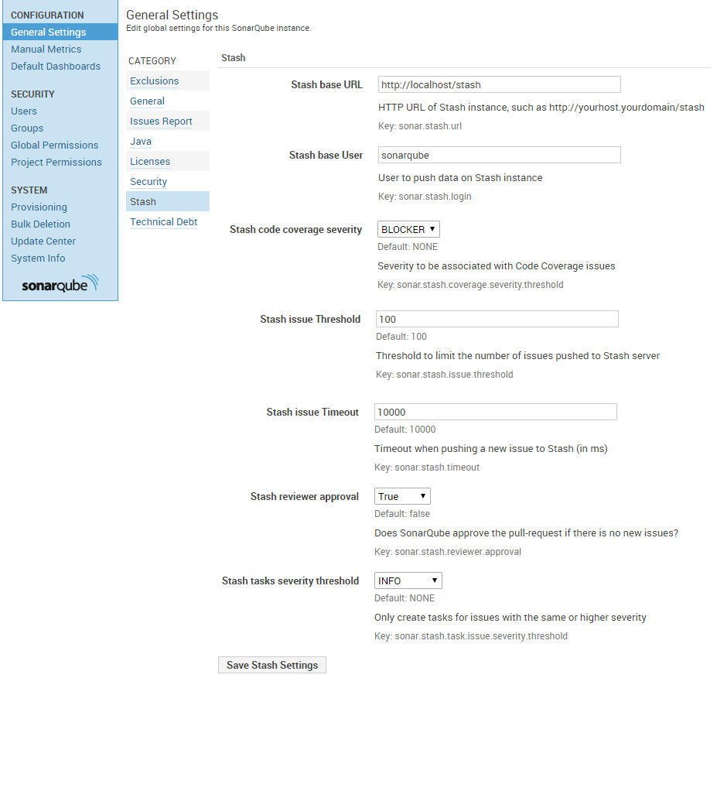
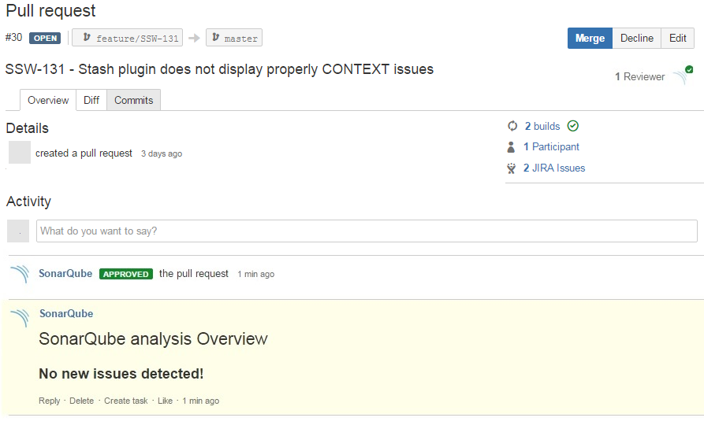

# SonarQube Stash (BitBucket) plugin

[](https://travis-ci.org/AmadeusITGroup/sonar-stash/branches)
[](https://sonarcloud.io/dashboard?id=org.sonar%3Asonar-stash-plugin)
[](https://sonarcloud.io/dashboard?id=org.sonar%3Asonar-stash-plugin)
[](https://sonarcloud.io/dashboard?id=org.sonar%3Asonar-stash-plugin)
[](https://sonarcloud.io/dashboard?id=org.sonar%3Asonar-stash-plugin)
[](https://sonarcloud.io/dashboard?id=org.sonar%3Asonar-stash-plugin)
[](https://sonarcloud.io/dashboard?id=org.sonar%3Asonar-stash-plugin)

**SonarQube is now a real reviewer!**
SonarQube Stash (BitBucket) plugin is a pull-request decorator which allows to integrate SonarQube violations directly into your pull-request.


After every run, in addition of the diff view, you may access to an overview of your SQ analysis:


## Getting started

#### Prerequisites
- Git client to checkout the code
- Maven 3.0.5+
- JDK 1.8+
- SonarQube 5.6 (LTS) or later
- Stash (BitBucket) REST API 1.0 (3.x, 4.x)

Note: these are the versions where the plugin has been tested. Other versions may or may not work, YMMV.

#### To build the plugin
This command generates a jar file:
```
mvn clean package
```

#### To deploy the plugin
Just copy the sonar-stash-plugin jar file to the plugin folder of the expected SonarQube server and restart the SonarQube server. For instance, on Linux platform:
```
cp target/sonar-stash-plugin-1.0.jar $SONARQUBE_HOME/extensions/plugins
```

#### Configuration on SonarQube server
Go to Stash general settings screen on SonarQube server to fill:



**Stash base URL** (sonar.stash.url): To define Stash instance.

**Stash base user** (sonar.stash.login): To define user to push violations on Stash pull-request. User must have **REPO_READ permission** for the repository. **Please notice Stash password needs to be provided to sonar-runner through sonar.stash.password on the commandline**.

**Stash user slug** (sonar.stash.user.slug): If the user username contains special characters the API requires the use of a different slug.

**Stash issue threshold** (sonar.stash.issue.threshold): To limit the number of issue pushed to Stash.

**Stash timeout** (sonar.stash.timeout): To timeout when Stash Rest api does not replied with expected.

**Stash reviewer approval** (sonar.stash.reviewer.approval): SonarQube is able to approve the pull-request if there is no new issue introduced by the change. By default, this feature is deactivated: if activated, **Stash base user must have REPO_WRITE permission for the repositories.** 

**Approval severity** (sonar.stash.reviewer.approval.severity.threshold): Only approve the pull-request if no issues higher than this threshold are detected.

**Include Analysis Overview Comment** (sonar.stash.include.overview): Toggles whether a comment with overview information should be created.



**Stash tasks severity threshold** (sonar.stash.task.issue.severity.threshold): SonarQube is able to create tasks for all issues with a severity higher to the threshold. By default, this feature is deactivated (threshold: NONE). 


**Include existing issues** (sonar.stash.include.existing.issues): Toggles whether already existing issues should also be reported.

**Include Vicinity Issues Range** (sonar.stash.include.vicinity.issues.range): Specifies in which area (in lines) around the current diff issues should be reported

**Excluded Rules** (sonar.stash.exclude.rules): Comma separated list of rules for which no comments should be created.

## How to run the plugin?

#### Plugin activation for an analysis

To activate the plugin, just add the following options to the SonarQube launcher (for instance with sonar-runner):

For SonarQube 5.2+:
```
sonar-runner -Dsonar.analysis.mode=issues \
	-Dsonar.stash.notification=true -Dsonar.stash.project=<PROJECT> -Dsonar.stash.repository=<REPO> \
	-Dsonar.stash.pullrequest.id=<PR_ID> -Dsonar.stash.password=<STASH_PASSWORD>...
```

#### Repository source configuration

To tell the plugin about the root directory of your repository use the `sonar.stash.repository.root` property.
This is necessary to correlate the the file locations between SonarQube and Stash.
```
sonar-runner -Dsonar.stash.repository.root="$PWD" -Dsonar.stash.notification
```


#### Reset comments of previous SonarQube analysis

If needed, you can reset comments published during the previous SonarQube analysis of your pull-request. Please add **sonar.stash.comments.reset** option to your SonarQube analysis. Please notice only comments linked to the **sonar.stash.login** user will be deleted. This reset will be the first action performed by the plugin.
 ```
sonar-runner -Dsonar.analysis.mode=incremental -Dsonar.stash.notification -Dsonar.stash.comments.reset -Dsonar.stash.project=<PROJECT> -Dsonar.stash.repository=<REPO> -Dsonar.stash.pullrequest.id=<PR_ID> -Dsonar.stash.password=<STASH_PASSWORD>...
```

## How to activate the coverage inside the pull-request

*This functionality has been moved to its own plugin: https://github.com/AmadeusITGroup/sonar-coverage-evolution*

## Protect passwords

The plugin can also read the password from an environment variable.
This is configured by setting `sonar.stash.password.variable` to the name of
the environment variable to read.
The prevents the password from leaking into the process table.

# How to contribute

* Before developing a major feature please open a ticket and announce it.
  Maybe the maintainers have strong opinions or useful hints about it.

* Add unit and for major features integration tests.
* Use the [Google Java Style Guide](https://google.github.io/styleguide/javaguide.html) for new development.
